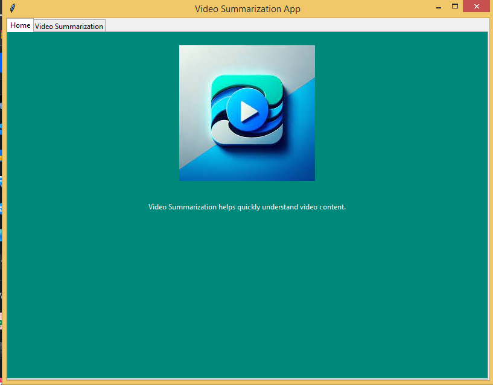

 Video-Summarization-Object-of-Interest

## Objective
The aim of this project is to develop a deep learning-based video summarization framework that allows users to efficiently summarize large volumes of surveillance video data, focusing specifically on predefined Objects of Interest (OoI) such as persons, airplanes, mobile phones, bikes, and cars. This system is designed to streamline the process of reviewing video content from surveillance footage, crucial for enhancing security measures and operational efficiency in both public and private sectors.

## Background
With the proliferation of digital video technology, surveillance systems have become ubiquitous in security and safety operations across various industries. These systems generate a substantial amount of video data daily, presenting challenges in storage, processing, and analysis. Traditional methods of video analysis are not only time-consuming but also require substantial computational resources, making them inefficient for real-time applications.

## Solution: Deep Learning-Based Video Summarization
The proposed framework leverages advanced deep learning algorithms to automatically detect and prioritize video segments that contain specified Objects of Interest. This approach significantly reduces the volume of data to be reviewed manually, thereby saving time and computational resources while maintaining the effectiveness of the surveillance system.
## Proposed Architecture of the Algorithm

The following diagram illustrates the architecture of the proposed framework for video summarization. This architecture is designed to utilize deep learning techniques for efficient object detection and summarization in surveillance videos.

)

This architecture is centered around the use of advanced object detection models and summarization algorithms to process and reduce large volumes of video data into concise segments that highlight critical Objects of Interest (OoI).

# GUI

  
  

## Video Comparison

original video and the output summarized video side by side for comparison:

<video src="Results_Videos/test1_output.mp4" controls title="Title"></video>  

## Technologies Used

  
  
  
  
  
  
  
  
  
  
  

## Key Features
- **Object of Interest Identification**: Utilizes state-of-the-art object recognition models to accurately identify and classify key objects in the video footage as specified by the user (e.g., person, airplane).
- **Customizable Summaries**: Allows users to customize the summary output based on specific objects of interest, enhancing the relevance of the summarized content to particular security or operational needs.
- **Efficiency and Scalability**: Designed to handle large volumes of video data efficiently, making it suitable for both small-scale and large-scale surveillance systems.
- **User-Friendly Interface**: Provides an intuitive interface for users to specify their preferences for summarization, making the system accessible to personnel without technical expertise.

## Implementation Strategy
1. **Data Collection**: Collect and annotate a diverse dataset of video clips containing the targeted objects of interest.
2. **Model Training**: Train deep learning models on the annotated dataset to develop robust object recognition capabilities.
3. **Summarization Algorithm**: Develop an algorithm that extracts and compiles video segments featuring the identified objects into a concise summary.
4. **Testing and Validation**: Test the framework with real-world surveillance footage to validate effectiveness, accuracy, and efficiency.

## Limitations
- **Dependency on Quality of Input Data**: The accuracy of object detection and summarization is highly dependent on the quality and resolution of the input video, which can vary significantly in real-world surveillance setups.
- **Processing Time**: Despite optimizations, processing high-resolution videos or large volumes of data can still be time-consuming and resource-intensive.
